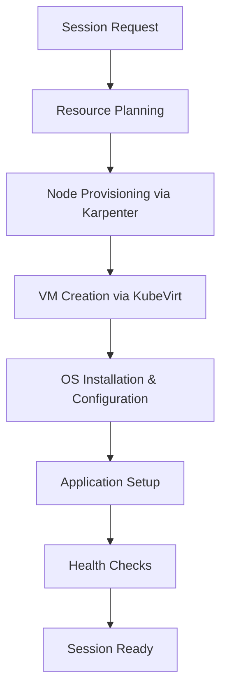

# Infrastructure SDK Implementation Plan
## VM-Based User Isolation and Lifecycle Management System

### Executive Summary

This document outlines a comprehensive implementation plan for an Infrastructure SDK that provides user-isolated VM environments with efficient lifecycle management and resource cleanup capabilities. Based on analysis of existing Karpenter capabilities and Windows desktop virtualization requirements, the SDK will leverage Kubernetes-native approaches combined with VM orchestration to deliver secure, scalable, and cost-effective infrastructure management.

### Key Objectives
- **User Isolation**: Complete isolation of user environments through dedicated VM instances
- **VM Lifecycle Management**: Automated VM provisioning, recycling, and cleanup
- **Resource Efficiency**: Intelligent resource allocation with cost optimization strategies
- **Developer Experience**: Clean, intuitive SDK interface for infrastructure operations

---

## Architecture Overview

### High-Level Architecture Components

```
┌─────────────────────────────────────────────────────────────┐
│                    Infrastructure SDK                        │
├─────────────────────────────────────────────────────────────┤
│  ┌─────────────┐  ┌─────────────┐  ┌─────────────┐         │
│  │ User Session│  │ VM Lifecycle│  │ Resource    │         │
│  │ Manager     │  │ Controller  │  │ Optimizer   │         │
│  └─────────────┘  └─────────────┘  └─────────────┘         │
├─────────────────────────────────────────────────────────────┤
│  ┌─────────────┐  ┌─────────────┐  ┌─────────────┐         │
│  │ Isolation   │  │ Cleanup     │  │ Monitoring  │         │
│  │ Engine      │  │ Orchestrator│  │ & Metrics   │         │
│  └─────────────┘  └─────────────┘  └─────────────┘         │
├─────────────────────────────────────────────────────────────┤
│                  Kubernetes Layer                           │
│  ┌─────────────┐  ┌─────────────┐  ┌─────────────┐         │
│  │ Karpenter   │  │ KubeVirt    │  │ Custom      │         │
│  │ Node Mgmt   │  │ VM Mgmt     │  │ Controllers │         │
│  └─────────────┘  └─────────────┘  └─────────────┘         │
├─────────────────────────────────────────────────────────────┤
│                    AWS Infrastructure                       │
│  ┌─────────────┐  ┌─────────────┐  ┌─────────────┐         │
│  │ EC2 Instances│  │ EBS Storage │  │ VPC Network │         │
│  │ (Spot/OnDem)│  │ & Snapshots │  │ & Security  │         │
│  └─────────────┘  └─────────────┘  └─────────────┘         │
└─────────────────────────────────────────────────────────────┘
```

### Core Design Principles

1. **Kubernetes-Native**: Leverages Kubernetes CRDs and controllers for resource management
2. **Event-Driven**: Implements reactive patterns similar to Karpenter's architecture
3. **Hybrid VM Approach**: Uses KubeVirt for VM orchestration within Kubernetes
4. **Cost-Optimized**: Intelligent spot instance usage and resource consolidation
5. **Security-First**: Complete network and compute isolation between users

---

## Core Components and Responsibilities

### 1. User Session Manager
**Primary Responsibility**: Orchestrate complete user session lifecycle from creation to termination

**Core Functions**:
- Session creation and authentication
- User-specific resource allocation
- Session state tracking and persistence
- Multi-tenant session coordination

**Key APIs**:
```go
type UserSessionManager interface {
    CreateSession(ctx context.Context, req *SessionRequest) (*Session, error)
    GetSession(ctx context.Context, sessionID string) (*Session, error)
    TerminateSession(ctx context.Context, sessionID string) error
    ListUserSessions(ctx context.Context, userID string) ([]*Session, error)
}
```

### 2. VM Lifecycle Controller
**Primary Responsibility**: Manage complete VM lifecycle from provisioning to decommissioning

**Core Functions**:
- Dynamic VM provisioning based on user requirements
- VM state management (running, idle, suspended, terminated)
- Automated VM recycling and fresh image deployment
- Health monitoring and automatic recovery

**Implementation Pattern**:
```go
type VMLifecycleController struct {
    kubevirtClient kubevirt.Interface
    karpenterClient karpenter.Interface
    vmTemplates VMTemplateManager
    stateTracker VMStateTracker
}

func (vlc *VMLifecycleController) ProvisionVM(ctx context.Context, spec *VMSpec) (*VM, error) {
    // 1. Validate resource requirements
    // 2. Select optimal node via Karpenter
    // 3. Create KubeVirt VM instance
    // 4. Configure networking and storage
    // 5. Initialize monitoring
}
```

### 3. Isolation Engine
**Primary Responsibility**: Ensure complete isolation between user environments

**Isolation Strategies**:
- **Compute Isolation**: Dedicated VM instances per user session
- **Network Isolation**: VPC subnets and security groups per user
- **Storage Isolation**: Encrypted EBS volumes with user-specific keys
- **Memory Isolation**: No shared memory spaces between user VMs

**Technical Implementation**:
```yaml
apiVersion: kubevirt.io/v1
kind: VirtualMachine
metadata:
  name: user-${USER_ID}-vm
  labels:
    isolation.infra-sdk.io/user-id: "${USER_ID}"
    isolation.infra-sdk.io/session-id: "${SESSION_ID}"
spec:
  template:
    spec:
      affinity:
        nodeAffinity:
          requiredDuringSchedulingIgnoredDuringExecution:
            nodeSelectorTerms:
            - matchExpressions:
              - key: dedicated-user
                operator: In
                values: ["${USER_ID}"]
```

### 4. Resource Optimizer
**Primary Responsibility**: Optimize cost and performance through intelligent resource management

**Optimization Strategies**:
- **Spot Instance Priority**: Prefer spot instances with graceful fallback to on-demand
- **Right-Sizing**: Dynamic resource allocation based on usage patterns
- **Consolidation**: Pack multiple small workloads when isolation permits
- **Predictive Scaling**: Pre-provision resources based on usage patterns

**Cost Optimization Metrics**:
- Target 60-70% cost reduction through spot instance usage
- 20-30% additional savings through intelligent scheduling
- 15-25% savings through idle resource reclamation

### 5. Cleanup Orchestrator
**Primary Responsibility**: Comprehensive resource cleanup and data sanitization

**Cleanup Phases**:
1. **Session Termination**: Graceful shutdown of user applications
2. **Data Sanitization**: Secure deletion of user data and temporary files
3. **VM Destruction**: Complete VM instance termination
4. **Resource Reclamation**: EBS volume deletion and network cleanup
5. **State Cleanup**: Remove session state and monitoring data

**Implementation Approach**:
```go
type CleanupOrchestrator struct {
    phases []CleanupPhase
    timeout time.Duration
    retryPolicy RetryPolicy
}

func (co *CleanupOrchestrator) ExecuteCleanup(ctx context.Context, sessionID string) error {
    for _, phase := range co.phases {
        if err := phase.Execute(ctx, sessionID); err != nil {
            return co.handleCleanupError(err, phase, sessionID)
        }
    }
    return nil
}
```

---

## User Isolation Strategy

### Multi-Layer Isolation Architecture

#### Layer 1: Compute Isolation
- **Dedicated EC2 Instances**: Each user session runs on a dedicated node
- **Hardware Isolation**: No shared CPU, memory, or local storage
- **Hypervisor Separation**: KubeVirt provides additional VM-level isolation

#### Layer 2: Network Isolation
```yaml
apiVersion: karpenter.k8s.aws/v1
kind: EC2NodeClass
metadata:
  name: user-isolated-nodeclass
spec:
  subnetSelectorTerms:
  - tags:
      karpenter.sh/discovery: "${CLUSTER_NAME}"
      isolation-type: "user-dedicated"
  securityGroupSelectorTerms:
  - tags:
      user-isolation: "enabled"
  userData: |
    #!/bin/bash
    # Configure iptables for additional network isolation
    iptables -A INPUT -i lo -j ACCEPT
    iptables -A INPUT -m conntrack --ctstate ESTABLISHED,RELATED -j ACCEPT
    iptables -A INPUT -p tcp --dport 22 -j ACCEPT
    iptables -A INPUT -j DROP
```

#### Layer 3: Storage Isolation
- **Encrypted EBS Volumes**: User-specific KMS keys for data encryption
- **Temporary Storage**: Ephemeral storage automatically wiped on termination
- **Backup Isolation**: User data backups stored in isolated S3 prefixes

#### Layer 4: Runtime Isolation
- **Process Isolation**: VM-level process separation
- **Memory Protection**: No shared memory between user sessions
- **Filesystem Isolation**: Separate root filesystems per user

### Isolation Validation Framework
```go
type IsolationValidator struct {
    networkValidator NetworkIsolationChecker
    computeValidator ComputeIsolationChecker
    storageValidator StorageIsolationChecker
}

func (iv *IsolationValidator) ValidateIsolation(ctx context.Context, sessionID string) (*IsolationReport, error) {
    report := &IsolationReport{SessionID: sessionID}
    
    report.NetworkIsolation = iv.networkValidator.Check(ctx, sessionID)
    report.ComputeIsolation = iv.computeValidator.Check(ctx, sessionID)
    report.StorageIsolation = iv.storageValidator.Check(ctx, sessionID)
    
    return report, nil
}
```

---

## VM Lifecycle Management Workflow

### Phase 1: VM Provisioning


**Detailed Steps**:
1. **Resource Planning**: Calculate required CPU, memory, storage, and network resources
2. **Node Provisioning**: Use Karpenter to provision appropriate EC2 instance
3. **VM Creation**: Deploy KubeVirt VM with Windows/Linux base image
4. **OS Configuration**: Apply security patches, user accounts, and base software
5. **Application Setup**: Install required applications and configure user environment
6. **Health Validation**: Comprehensive health checks before marking session as ready

### Phase 2: Active Session Management
```go
type SessionStateManager struct {
    activeMonitor ActiveSessionMonitor
    idleDetector IdleSessionDetector
    healthChecker HealthChecker
}

func (ssm *SessionStateManager) ManageSession(ctx context.Context, sessionID string) {
    for {
        select {
        case <-ctx.Done():
            return
        case <-time.After(30 * time.Second):
            state := ssm.checkSessionState(sessionID)
            switch state {
            case SessionStateIdle:
                ssm.handleIdleSession(sessionID)
            case SessionStateUnhealthy:
                ssm.handleUnhealthySession(sessionID)
            case SessionStateActive:
                ssm.updateLastActivity(sessionID)
            }
        }
    }
}
```

### Phase 3: VM Recycling and Cleanup
**Recycling Triggers**:
- User session termination
- Idle timeout exceeded (configurable, default 2 hours)
- VM health check failures
- Scheduled maintenance windows

**Recycling Process**:
1. **Graceful Shutdown**: Allow applications 60 seconds to save state and exit
2. **Data Backup**: Optional backup of user data to persistent storage
3. **VM Termination**: Immediate VM instance destruction
4. **Storage Cleanup**: EBS volume deletion with secure wipe
5. **Network Cleanup**: Security group and subnet cleanup
6. **State Cleanup**: Remove session metadata and monitoring data

---

## Resource Cleanup Mechanisms

### Automated Cleanup Pipeline

#### 1. Reactive Cleanup (Immediate)
```go
type ReactiveCleanupHandler struct {
    vmManager VirtualMachineManager
    storageManager StorageManager
    networkManager NetworkManager
    monitoringManager MonitoringManager
}

func (rch *ReactiveCleanupHandler) HandleSessionTermination(event *SessionTerminationEvent) error {
    cleanupTasks := []CleanupTask{
        &VMCleanupTask{sessionID: event.SessionID},
        &StorageCleanupTask{sessionID: event.SessionID},
        &NetworkCleanupTask{sessionID: event.SessionID},
        &MonitoringCleanupTask{sessionID: event.SessionID},
    }
    
    return rch.executeParallelCleanup(cleanupTasks)
}
```

#### 2. Scheduled Cleanup (Background)
- **Orphaned Resource Detection**: Daily scan for resources without active sessions
- **Zombie Process Cleanup**: Weekly cleanup of stalled VM processes
- **Storage Garbage Collection**: Automated cleanup of expired temporary storage
- **Metric Data Pruning**: Monthly cleanup of historical monitoring data

#### 3. Emergency Cleanup (Failure Recovery)
```go
type EmergencyCleanupService struct {
    resourceDetector OrphanedResourceDetector
    forceCleanup ForceCleanupExecutor
    alertManager AlertManager
}

func (ecs *EmergencyCleanupService) ExecuteEmergencyCleanup(ctx context.Context) error {
    orphaned := ecs.resourceDetector.DetectOrphanedResources(ctx)
    
    for _, resource := range orphaned {
        if err := ecs.forceCleanup.ForceCleanup(ctx, resource); err != nil {
            ecs.alertManager.SendAlert("Emergency cleanup failed", err)
        }
    }
    
    return nil
}
```

### Cleanup Validation and Auditing
```go
type CleanupAuditor struct {
    validator CleanupValidator
    logger AuditLogger
    reporter ComplianceReporter
}

func (ca *CleanupAuditor) AuditCleanup(sessionID string) (*CleanupAuditReport, error) {
    report := &CleanupAuditReport{
        SessionID: sessionID,
        Timestamp: time.Now(),
    }
    
    report.VMCleaned = ca.validator.ValidateVMCleanup(sessionID)
    report.StorageCleaned = ca.validator.ValidateStorageCleanup(sessionID)
    report.NetworkCleaned = ca.validator.ValidateNetworkCleanup(sessionID)
    
    ca.logger.LogAudit(report)
    return report, nil
}
```

---

## API Design Considerations

### RESTful API Design
```yaml
# Core API Endpoints
POST   /api/v1/sessions                    # Create new session
GET    /api/v1/sessions/{id}               # Get session details
DELETE /api/v1/sessions/{id}               # Terminate session
GET    /api/v1/sessions                    # List sessions (with filters)
POST   /api/v1/sessions/{id}/actions/suspend  # Suspend session
POST   /api/v1/sessions/{id}/actions/resume   # Resume session

# Administrative Endpoints
GET    /api/v1/admin/resources              # Resource usage overview
GET    /api/v1/admin/costs                  # Cost analysis
POST   /api/v1/admin/cleanup                # Force cleanup operation
GET    /api/v1/admin/health                 # System health status
```

### SDK Client Libraries

#### Go SDK
```go
package infrasdk

type Client struct {
    httpClient *http.Client
    baseURL    string
    auth       AuthProvider
}

func NewClient(config *Config) (*Client, error) {
    return &Client{
        httpClient: config.HTTPClient,
        baseURL:    config.BaseURL,
        auth:       config.AuthProvider,
    }, nil
}

func (c *Client) CreateSession(ctx context.Context, req *CreateSessionRequest) (*Session, error) {
    // Implementation with proper error handling, retries, and validation
}
```

#### Python SDK
```python
from typing import Optional, List, Dict, Any
import asyncio
import aiohttp

class InfraSDKClient:
    def __init__(self, base_url: str, auth_token: str):
        self.base_url = base_url
        self.auth_token = auth_token
        self._session: Optional[aiohttp.ClientSession] = None
    
    async def create_session(
        self, 
        user_id: str, 
        resources: Dict[str, Any],
        ttl: Optional[str] = None
    ) -> Dict[str, Any]:
        """Create a new user session with specified resources."""
        async with self._get_session() as session:
            payload = {
                "user_id": user_id,
                "resources": resources,
                "ttl": ttl or "2h"
            }
            async with session.post(f"{self.base_url}/api/v1/sessions", json=payload) as resp:
                return await resp.json()
```

### Event-Driven Architecture
```go
type EventType string

const (
    EventSessionCreated    EventType = "session.created"
    EventSessionTerminated EventType = "session.terminated"
    EventVMProvisioned    EventType = "vm.provisioned"
    EventVMHealthy        EventType = "vm.healthy"
    EventCleanupCompleted EventType = "cleanup.completed"
)

type Event struct {
    ID        string                 `json:"id"`
    Type      EventType             `json:"type"`
    SessionID string                `json:"session_id"`
    Timestamp time.Time             `json:"timestamp"`
    Payload   map[string]interface{} `json:"payload"`
}

type EventHandler interface {
    Handle(ctx context.Context, event *Event) error
}
```

---

## Implementation Phases and Milestones

### Phase 1: Foundation (Weeks 1-4)
**Milestone: Core Infrastructure Setup**

**Week 1-2: Project Bootstrap**
- [ ] Set up Go project structure with proper module organization
- [ ] Implement Kubernetes client libraries and CRD definitions
- [ ] Create basic project documentation and contribution guidelines
- [ ] Set up CI/CD pipeline with automated testing

**Week 3-4: Core API Framework**
- [ ] Implement RESTful API server with Gin/Echo framework
- [ ] Create authentication and authorization middleware
- [ ] Develop basic session management data structures
- [ ] Implement health check and metrics endpoints

**Deliverables**:
- Working API server with basic endpoints
- Kubernetes CRD definitions for sessions and VMs
- Basic project documentation
- Automated test suite with 70%+ coverage

### Phase 2: VM Lifecycle Management (Weeks 5-8)
**Milestone: Complete VM Orchestration**

**Week 5-6: KubeVirt Integration**
- [ ] Implement KubeVirt VM management controllers
- [ ] Create VM template management system
- [ ] Develop VM provisioning and configuration logic
- [ ] Implement VM health monitoring and recovery

**Week 7-8: Karpenter Integration**
- [ ] Integrate with Karpenter for node provisioning
- [ ] Implement spot instance optimization strategies
- [ ] Create cost tracking and optimization algorithms
- [ ] Develop node tainting and user isolation logic

**Deliverables**:
- Complete VM lifecycle management system
- Karpenter-based node provisioning
- Cost optimization framework
- VM health monitoring dashboard

### Phase 3: User Isolation and Security (Weeks 9-12)
**Milestone: Production-Ready Isolation**

**Week 9-10: Multi-Layer Isolation**
- [ ] Implement compute isolation through dedicated nodes
- [ ] Create network isolation with VPC and security groups
- [ ] Develop storage encryption and isolation mechanisms
- [ ] Build runtime isolation validation tools

**Week 11-12: Security Hardening**
- [ ] Implement comprehensive security policies
- [ ] Create security audit and compliance reporting
- [ ] Develop threat detection and response mechanisms
- [ ] Implement data loss prevention (DLP) controls

**Deliverables**:
- Complete user isolation system
- Security compliance framework
- Audit and monitoring tools
- Security documentation and runbooks

### Phase 4: Resource Optimization (Weeks 13-16)
**Milestone: Cost-Optimized Operations**

**Week 13-14: Advanced Resource Management**
- [ ] Implement predictive scaling algorithms
- [ ] Create resource right-sizing recommendations
- [ ] Develop workload consolidation strategies
- [ ] Build cost forecasting and budgeting tools

**Week 15-16: Cleanup and Efficiency**
- [ ] Implement comprehensive cleanup orchestration
- [ ] Create automated resource garbage collection
- [ ] Develop resource efficiency metrics and reporting
- [ ] Build capacity planning and optimization tools

**Deliverables**:
- Advanced resource optimization system
- Comprehensive cleanup orchestration
- Cost management and forecasting tools
- Performance optimization dashboard

### Phase 5: SDK and Integration (Weeks 17-20)
**Milestone: Developer-Ready SDK**

**Week 17-18: Client SDK Development**
- [ ] Implement Go SDK with full API coverage
- [ ] Create Python SDK with async support
- [ ] Develop TypeScript/JavaScript SDK for web integration
- [ ] Build comprehensive SDK documentation and examples

**Week 19-20: Integration and Testing**
- [ ] Create integration testing suite
- [ ] Implement load testing and performance validation
- [ ] Develop monitoring and observability integration
- [ ] Build example applications and use cases

**Deliverables**:
- Multi-language SDK suite
- Comprehensive integration tests
- Performance benchmarking results
- Production deployment guides

### Phase 6: Production Readiness (Weeks 21-24)
**Milestone: Production Deployment**

**Week 21-22: Operational Excellence**
- [ ] Implement comprehensive logging and monitoring
- [ ] Create alerting and incident response procedures
- [ ] Develop backup and disaster recovery mechanisms
- [ ] Build operational runbooks and procedures

**Week 23-24: Performance and Scale**
- [ ] Conduct performance tuning and optimization
- [ ] Implement horizontal scaling capabilities
- [ ] Create multi-region deployment support
- [ ] Develop capacity planning and scaling guidelines

**Deliverables**:
- Production-ready system
- Complete operational documentation
- Multi-region deployment capability
- Performance and scaling validation

---

## Technical Considerations and Challenges

### Challenge 1: Windows Container Limitations
**Problem**: Windows containers cannot support full desktop environments or GUI applications.

**Solution**: Hybrid architecture using KubeVirt VMs within Kubernetes for complete Windows desktop support.

**Technical Implementation**:
- Use KubeVirt to orchestrate Windows VMs on Kubernetes
- Implement RDP/VNC access through Apache Guacamole
- Optimize VM startup times through Fast Launch and custom AMIs
- Target sub-60-second VM provisioning times

### Challenge 2: Cost Management with VM-Based Architecture
**Problem**: VMs are inherently more expensive than containers due to OS overhead.

**Solution**: Aggressive spot instance adoption and intelligent resource optimization.

**Technical Implementation**:
```go
type CostOptimizer struct {
    spotInstancePredictor SpotPricePredictor
    resourceRightSizer    ResourceRightSizer
    consolidationEngine   WorkloadConsolidator
}

func (co *CostOptimizer) OptimizeSession(ctx context.Context, req *SessionRequest) (*OptimizedSessionSpec, error) {
    // 1. Predict spot instance availability and pricing
    spotAvailability := co.spotInstancePredictor.PredictAvailability(req.Region, req.InstanceTypes)
    
    // 2. Right-size resources based on workload requirements
    rightSizedResources := co.resourceRightSizer.CalculateOptimalSize(req.Resources)
    
    // 3. Consider consolidation opportunities
    consolidationOptions := co.consolidationEngine.FindConsolidationOpportunities(req)
    
    return co.generateOptimizedSpec(spotAvailability, rightSizedResources, consolidationOptions)
}
```

### Challenge 3: VM Startup Time Optimization
**Problem**: Traditional VM startup can take 3-5 minutes, impacting user experience.

**Solution**: Multi-layered startup optimization strategy.

**Optimization Layers**:
1. **Base Optimization** (Target: 90 seconds)
   - Enable EC2 Fast Launch
   - Use GP3 storage with optimized IOPS
   - Pre-cache common application images

2. **Advanced Optimization** (Target: 45-60 seconds)
   - Custom bootstrap implementation
   - Aggressive image caching strategies
   - Parallel initialization processes

3. **Extreme Optimization** (Target: 30 seconds)
   - IO2 Block Express storage
   - Custom Windows services
   - Pre-warmed instance pools

### Challenge 4: Resource Leak Prevention
**Problem**: Failed cleanup operations can lead to resource leaks and cost overruns.

**Solution**: Multi-layered cleanup with validation and emergency procedures.

**Implementation Strategy**:
```go
type CleanupStrategy struct {
    primaryCleanup   PrimaryCleanupExecutor
    fallbackCleanup  FallbackCleanupExecutor
    emergencyCleanup EmergencyCleanupExecutor
    validator       CleanupValidator
}

func (cs *CleanupStrategy) ExecuteCleanup(ctx context.Context, sessionID string) error {
    // Primary cleanup attempt
    if err := cs.primaryCleanup.Execute(ctx, sessionID); err == nil {
        return cs.validateCleanup(sessionID)
    }
    
    // Fallback cleanup attempt
    if err := cs.fallbackCleanup.Execute(ctx, sessionID); err == nil {
        return cs.validateCleanup(sessionID)
    }
    
    // Emergency cleanup with alerts
    return cs.emergencyCleanup.Execute(ctx, sessionID)
}
```

### Challenge 5: Multi-Tenant Security
**Problem**: Ensuring complete isolation between user sessions in a shared infrastructure.

**Solution**: Defense-in-depth security architecture.

**Security Layers**:
1. **Infrastructure Isolation**: Dedicated EC2 instances per user
2. **Network Isolation**: VPC subnets and security groups
3. **Storage Isolation**: Encrypted EBS with user-specific keys
4. **Runtime Isolation**: VM-level process separation
5. **Data Isolation**: Secure data deletion and sanitization

---

## Testing Strategy

### Unit Testing Framework
```go
type TestSuite struct {
    kubernetesClient fake.Clientset
    mockAWSClient   *mocks.AWSClient
    testNamespace   string
}

func (ts *TestSuite) TestVMLifecycleController() {
    controller := NewVMLifecycleController(ts.kubernetesClient, ts.mockAWSClient)
    
    // Test VM provisioning
    vm, err := controller.ProvisionVM(context.Background(), &VMSpec{
        UserID: "test-user",
        Resources: ResourceSpec{CPU: "2", Memory: "4Gi"},
    })
    assert.NoError(ts.T(), err)
    assert.Equal(ts.T(), "test-user", vm.Labels["user-id"])
    
    // Test VM cleanup
    err = controller.CleanupVM(context.Background(), vm.Name)
    assert.NoError(ts.T(), err)
}
```

### Integration Testing
**Test Scenarios**:
1. **End-to-End Session Workflow**: Complete user session lifecycle from creation to cleanup
2. **Failure Recovery Testing**: VM failures, node failures, network partitions
3. **Cost Optimization Validation**: Spot instance handling, resource right-sizing
4. **Security Isolation Testing**: Multi-user scenarios with isolation validation
5. **Performance Testing**: Concurrent session creation, resource scaling

### Load Testing Framework
```go
type LoadTester struct {
    client *InfraSDKClient
    metrics *MetricsCollector
}

func (lt *LoadTester) RunConcurrentSessionTest(userCount int, duration time.Duration) *LoadTestResults {
    results := &LoadTestResults{}
    
    // Create concurrent users
    var wg sync.WaitGroup
    for i := 0; i < userCount; i++ {
        wg.Add(1)
        go func(userID string) {
            defer wg.Done()
            lt.simulateUserSession(userID, duration, results)
        }(fmt.Sprintf("user-%d", i))
    }
    
    wg.Wait()
    return results
}
```

### Chaos Engineering
**Chaos Scenarios**:
- Random VM termination during active sessions
- Network partition between control plane and worker nodes
- Spot instance interruption simulation
- Storage volume failures and recovery
- Kubernetes API server outages

---

## Success Metrics and KPIs

### Performance Metrics
- **VM Startup Time**: Target <60 seconds (90th percentile)
- **API Response Time**: Target <500ms (95th percentile)
- **Session Creation Success Rate**: Target >99.5%
- **Resource Cleanup Success Rate**: Target >99.9%

### Cost Metrics
- **Infrastructure Cost Reduction**: Target 60-70% vs. traditional deployment
- **Spot Instance Utilization**: Target >70% of total compute
- **Resource Utilization Efficiency**: Target >85% average utilization
- **Idle Resource Waste**: Target <5% of total resources

### Reliability Metrics
- **System Uptime**: Target 99.95% availability
- **Mean Time to Recovery (MTTR)**: Target <5 minutes
- **Mean Time Between Failures (MTBF)**: Target >30 days
- **Data Loss Rate**: Target 0% (zero tolerance)

### User Experience Metrics
- **Session Availability**: Target <2 minutes from request to ready
- **Session Reliability**: Target >99.9% successful sessions
- **User Isolation Validation**: Target 100% isolation success rate
- **Support Ticket Volume**: Target <1 ticket per 1000 sessions

---

## Risk Assessment and Mitigation

### Technical Risks

#### High Risk: VM Startup Time Variability
**Risk**: Inconsistent VM startup times affecting user experience
**Probability**: High | **Impact**: High
**Mitigation**:
- Implement pre-warmed instance pools for immediate availability
- Create fallback mechanisms for delayed startup scenarios
- Develop predictive scaling based on usage patterns

#### Medium Risk: Spot Instance Interruptions
**Risk**: Spot instance interruptions causing session failures
**Probability**: Medium | **Impact**: Medium
**Mitigation**:
- Implement graceful spot interruption handling
- Automatic failover to on-demand instances
- User notification and session state preservation

#### Medium Risk: Resource Leak Accumulation
**Risk**: Failed cleanup operations causing cost overruns
**Probability**: Medium | **Impact**: High
**Mitigation**:
- Multi-layered cleanup validation
- Automated orphaned resource detection
- Emergency cleanup procedures and alerts

### Business Risks

#### High Risk: Cost Overruns
**Risk**: Unexpected infrastructure costs exceeding budgets
**Probability**: Medium | **Impact**: High
**Mitigation**:
- Comprehensive cost monitoring and alerting
- Automated cost controls and resource limits
- Regular cost optimization reviews and adjustments

#### Medium Risk: Security Breach
**Risk**: User data exposure due to isolation failures
**Probability**: Low | **Impact**: Very High
**Mitigation**:
- Multi-layered security architecture
- Regular security audits and penetration testing
- Incident response procedures and data breach protocols

---

## Conclusion

This comprehensive implementation plan provides a roadmap for developing a production-ready Infrastructure SDK that delivers secure, cost-effective, and scalable VM-based user isolation. By leveraging Kubernetes-native approaches combined with intelligent resource management, the system will achieve significant cost savings while maintaining high security and performance standards.

The phased approach ensures steady progress with validated milestones, while the comprehensive testing strategy and risk mitigation plans provide confidence in production deployment. The resulting SDK will enable developers to easily provision isolated VM environments with automatic lifecycle management and resource optimization.

**Key Success Factors**:
1. Adherence to Kubernetes-native patterns for long-term maintainability
2. Aggressive cost optimization through spot instances and intelligent scheduling
3. Comprehensive security isolation preventing any cross-user data exposure
4. Robust cleanup mechanisms preventing resource leaks
5. Developer-friendly SDK interfaces enabling easy adoption

The implementation timeline of 24 weeks provides realistic milestones while ensuring thorough testing and validation at each phase. The resulting system will serve as a foundation for scalable, secure, and cost-effective infrastructure management in cloud-native environments.